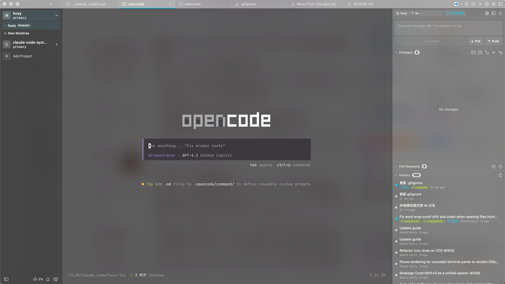

<p align="center">
  
</p>

<h1 align="center">Muxy</h1>

<p align="center">Lightweight and Memory efficient terminal for Mac built with SwiftUI and <a href="https://github.com/ghostty-org/ghostty">libghostty</a>.</p>
<p align="center"><p align="center"><a href="#install">Mac</a> | <a href="#ios">iOS</a> | <a href="#android">Android</a> | <a href="https://discord.gg/4eMXAmJQ2n">Discord</a></p>

<div align="center">
  
  
  
  
</div>
## Screenshots

这个项目来自 https://github.com/jasonkneen/huxy 的修改版本基础上进行了一些修改。

其实也没做什么！

最早就是觉得Muxy的工作流，还是比较喜欢，想尝试。后来看到X上，很多人都在推荐 jasonkneen 的这个修改版本。

就自己打包安装了一下。不过，我还是想要毛玻璃效果。就开始自己尝试修改swift的代码实现效果。原分支有一个配置，不过，后来再拉新的就没有了。

还是搞了几天，还是搞出来了。后边再做什么？我没想好。目前要先体验这里边的这些功能把。

### 📋 构建与运行

注意看一下 scripts 文件夹下边的脚本。

```bash
# 安装依赖（首次）
scripts/setup.sh          # 下载 GhosttyKit.xcframework

# 开发构建
swift build               # 验证构建
swift run Muxy            # 运行应用

# 检查与测试
scripts/checks.sh         # 格式 → 语法检查 → 构建 → 测试
scripts/checks.sh --fix   # 自动修复格式和语法问题
```



## Features

- **Project-based workflow** — Organize terminals by project with persistent workspace state
- **Vertical tabs** — Sidebar tab strip with drag-and-drop reordering, pinning, renaming, and middle-click close
- **Split panes** — Horizontal and vertical splits with keyboard navigation and resizable dividers
- **Built-in VCS** — Simple and lightweight basic git diff and operations
- **200+ themes** — Browse and search Ghostty themes with a built-in theme picker
- **Customizable shortcuts** — 40+ configurable keyboard shortcuts with conflict detection
- **Workspace persistence** — Tabs, splits, and focus state are saved and restored per project
- **In-terminal search** — Find text in terminal output with match navigation
- **Drag and drop** — Reorder tabs and projects, drag tabs between panes to create splits
- **Auto-updates** — Built-in update checking via Sparkle
- **Text Editor** - Native, Lightweight Text (not code) Editor with code highlight support for most of the programming languages

## Requirements

- macOS 14+
- Swift 6.0+
- Ghostty installed (optional for themes)
- `gh` installed (optional for PR management)

## Install

### Homebrew

```bash
brew tap muxy-app/tap
brew install --cask muxy
```

### Manual

Download the latest release from the [releases page](https://github.com/muxy-app/muxy/releases)

### iOS

The iOS app is available for testers on TestFlight

- Install the iOS app via TestFlight (https://testflight.apple.com/join/7t1AaYHW)
- Open Muxy on your Mac
- Go to Settings (Cmd + `,`)
- Go to Mobile tab
- Toggle the `Allow mobile device connection`
- Open the iOS app
- Enter the IP and Port
- Approve the connection on your Mac
- Test and open issues for the bugs

**The iOS app's source is available in [this repo](https://github.com/muxy-app/mobile)**

### Android

The Android app is available for Closed Testing

- Join the [Testers Google Groups](https://groups.google.com/g/muxy-testers)
- Apply being a tester at this [Link](https://play.google.com/apps/testing/com.muxy.app)
- Install the app from [Google Play Store](https://play.google.com/store/apps/details?id=com.muxy.app)
- Open Muxy on your Mac
- Go to Settings (Cmd + `,`)
- Go to Mobile tab
- Toggle the `Allow mobile device connection`
- Open the Android app
- Enter the IP and Port
- Approve the connection on your Mac
- Test and open issues for the bugs

**The Android app's source is available in [this repo](https://github.com/muxy-app/mobile)**

## Local Development

```bash
scripts/setup.sh          # downloads GhosttyKit.xcframework
swift build               # debug build
swift run Muxy             # run
```

## License

[MIT](LICENSE)
