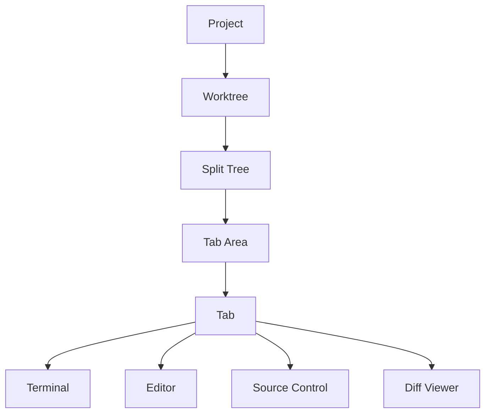

# Muxy Documentation

Muxy is a native macOS terminal multiplexer organized around projects, worktrees, tabs, and split panes. It also ships a built-in editor, source-control UI, file tree, and a WebSocket API for companion apps.

## User Guide

| Page | What's in it |
| --- | --- |
| [Getting Started](user-guide/getting-started.md) | Install, add a project, first tabs |
| [Keyboard Shortcuts](user-guide/keyboard-shortcuts.md) | Default bindings, all remappable |
| [Settings](user-guide/settings.md) | Every preference tab explained |
| [Troubleshooting](user-guide/troubleshooting.md) | Logs, common fixes, reset state |

## Feature Guides

| Page | What's in it |
| --- | --- |
| [Projects](features/projects.md) | Add/switch projects, IDE launch, CLI, URL scheme |
| [Project Workspaces](features/project-workspaces.md) | Filter projects into named sidebar workspaces |
| [Worktrees](features/worktrees.md) | Per-worktree workspaces, setup commands |
| [Tabs & Splits](features/tabs-and-splits.md) | Tab kinds, splits, drag & drop, pinning |
| [Terminal](features/terminal.md) | Ghostty config, find, copy/paste, custom commands |
| [Rich Input](features/rich-input.md) | Multiline prompts, files, images, broadcast send |
| [Session Restore](features/session-restore.md) | Restore terminal tabs after restart |
| [Editor](features/editor.md) | Built-in editor, quick open, markdown preview |
| [Source Control](features/source-control.md) | Git status, diff, branches, pull requests |
| [File Tree](features/file-tree.md) | Gitignore-aware tree, file ops, drag & drop |
| [Notifications](features/notifications.md) | OSC sequences, hooks, socket API |
| [AI Assistant](features/ai-assistant.md) | Draft commit messages and PR text from diffs |
| [AI Usage](features/ai-usage.md) | Claude Code, Copilot, Codex, Cursor, and more |
| [Themes](features/themes.md) | Theme picker and Ghostty config |

## Layouts

| Page | What's in it |
| --- | --- |
| [Overview](layouts/overview.md) | Declarative `.muxy/layouts/*.yaml` workspaces |
| [Schema](layouts/schema.md) | Fields, single panes, split trees, JSON form |
| [Examples](layouts/examples.md) | Ready-to-adapt layout recipes |

## Remote Server

| Page | What's in it |
| --- | --- |
| [Overview](remote-server/overview.md) | WebSocket API for mobile clients |
| [Setup](remote-server/setup.md) | Enable the server, port, security model |
| [Pairing](remote-server/pairing.md) | Authenticate, pair, register flow |
| [Protocol](remote-server/protocol.md) | Message envelope, request/response/event |
| [Methods](remote-server/methods.md) | Every RPC method and its parameters |
| [Events](remote-server/events.md) | Server-pushed events and their payloads |
| [Data Objects](remote-server/data-objects.md) | Project, worktree, workspace, notification, terminal snapshot |

## Architecture

| Page | What's in it |
| --- | --- |
| [Overview](architecture/overview.md) | System overview, components, data flow |
| [Package Overview](architecture/package-overview.md) | Package structure, top-level layout |
| [State Management](architecture/state-management.md) | AppState, reducer, persistence, navigation history |
| [Ghostty Integration](architecture/ghostty-integration.md) | GhosttyService, surface lifecycle, runtime events |
| [Editor Geometry](architecture/editor-geometry.md) | HeightMap + scroll-anchor reflow |
| [Markdown Preview](architecture/markdown-preview.md) | WKWebView rendering, link routing, image schemes |
| [File Tree](architecture/file-tree.md) | Lazy tree, git-status colors, file ops |
| [Source Control](architecture/vcs.md) | Source Control tab, PR flow |
| [Notifications](architecture/notifications.md) | Sources, routing, click-to-navigate |
| [UI Scaling](architecture/ui-scaling.md) | Centralized chrome metrics with user-adjustable scale |
| [AI Usage Tracking](architecture/ai-usage.md) | Provider registry, credentials, refresh lifecycle |
| [Remote Server](architecture/remote-server.md) | WebSocket server, terminal streaming, pairing |
| [CLI & URL Scheme](architecture/cli-and-url-scheme.md) | `muxy` wrapper, `muxy://` URL, socket entry |
| [Updates](architecture/updates.md) | Sparkle channels and release flow |

## Developer

| Page | What's in it |
| --- | --- |
| [Building Ghostty](developer/building-ghostty.md) | Building the GhosttyKit xcframework |
