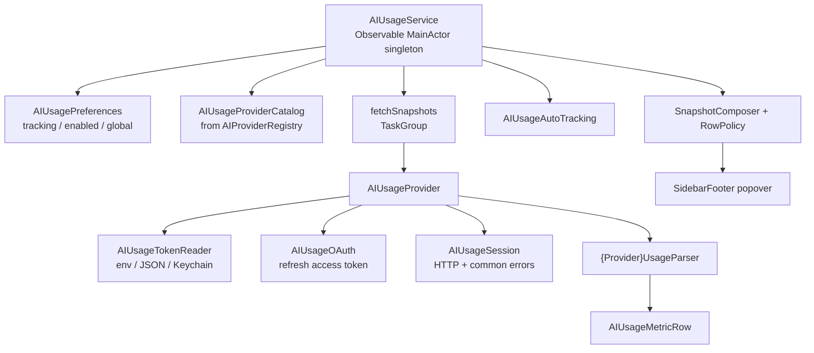

# AI Usage Tracking

Muxy reads usage / quota data for the user's AI coding tools and surfaces it in a sidebar popover. Tracking is **read-only**: Muxy reads credentials the user already configured for each tool and queries the vendor's usage endpoint directly. Nothing is written to tools' settings; nothing leaves the user's Mac for Muxy's servers.

## Component map

The service is observed by `SidebarFooter` (preview icon + popover) and `AIUsageSettingsView`. Both hold the singleton as `let` and rely on `@Observable` to invalidate on read.

## Providers

`AIUsageProvider` is the read-only counterpart to `AIProviderIntegration`. A single concrete type can adopt both (e.g. `ClaudeCodeProvider` installs hooks AND fetches usage). `AIProviderRegistry.usageProviders` lists all usage providers — Claude Code, Codex, Copilot, Amp, Z.ai, MiniMax, Kimi, Factory.

Each provider has a matching `{Name}UsageParser` taking raw JSON → `[AIUsageMetricRow]`. Parsers are unit-tested against fixture payloads in `Tests/MuxyTests/Services/*UsageParserTests.swift`; HTTP paths are tested with `URLProtocol` stubs in `*UsageAPIClientTests.swift` where present.

## Credentials

`AIUsageTokenReader` is the single entry point, tried in provider-defined order:

1. Environment variables (`CLAUDE_CODE_OAUTH_TOKEN`, `ZAI_API_KEY`, …).
2. JSON credential files written by the vendor CLI under `~/.claude`, `~/.codex`, etc. Some providers honor env-var overrides (`CLAUDE_CONFIG_DIR`, `CODEX_HOME`).
3. macOS Keychain via `/usr/bin/security find-generic-password`. The account name is passed via `Process.arguments` (array form, not a shell string) to avoid argument injection.

OAuth providers (Factory, Kimi) use `AIUsageOAuth.refreshAccessToken` to exchange a refresh token and persist the updated credential file with the same shape the vendor CLI wrote.

## Refresh lifecycle

`AIUsageService.refresh(force:)` and `refreshIfNeeded()` are coalesced: an in-flight task is awaited rather than parallelized. `@MainActor` plus an internal `refreshTask` field gates concurrent entry. Auto-refresh cadence is `AIUsageAutoRefreshInterval` (5m / 15m / 30m / 1h) persisted in UserDefaults; a 60-second view-level timer in `SidebarFooter` calls `refreshIfNeeded` and the service decides whether enough time has elapsed.

## Settings & defaults

Per-provider flags live in `UserDefaults` keyed by the canonical provider ID:

| Key | Purpose |
| --- | --- |
| `muxy.usage.provider.<id>.tracked` | Provider has at least one snapshot; included in the popover. |
| `muxy.usage.provider.<id>.enabled` | User toggle in settings. |
| `muxy.usage.enabled` | Global on/off. |
| `muxy.usage.displayMode` | `used` or `remaining`. |
| `muxy.usage.autoRefreshIntervalSeconds` | Cadence. |
| `muxy.usage.showSecondaryLimits` | Show weekly/monthly/billing rows. |

On first launch `AIUsageSettingsStore.isUsageEnabled()` runs a one-shot migration: if any provider already has a tracked preference, the global flag is turned on so users who enabled tracking before the global toggle existed keep seeing the panel.

## Row policy

`AIUsageRowPolicy` splits metric rows into primary (session / 5h / hourly / premium) and secondary (weekly / monthly / daily / billing) buckets by label prefix. By default the UI shows only primary rows; the "Show Secondary Limits" toggle opts into the full list. Dollar-denominated detail strings are filtered out so the sidebar stays focused on quotas.
