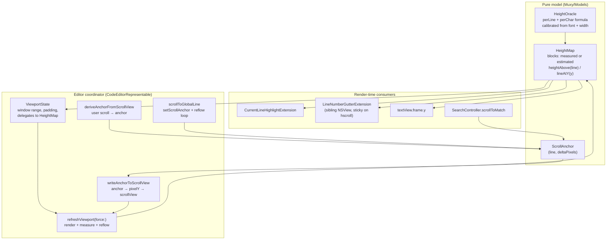
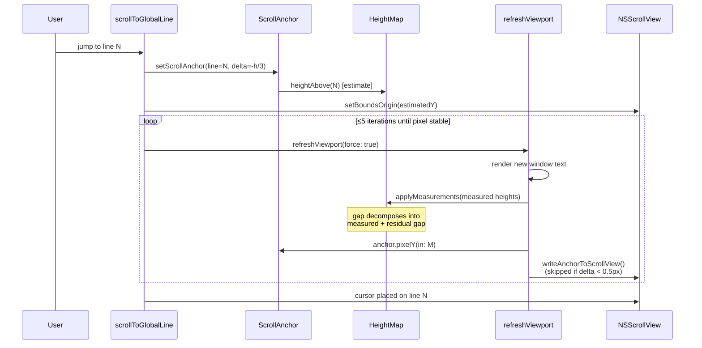
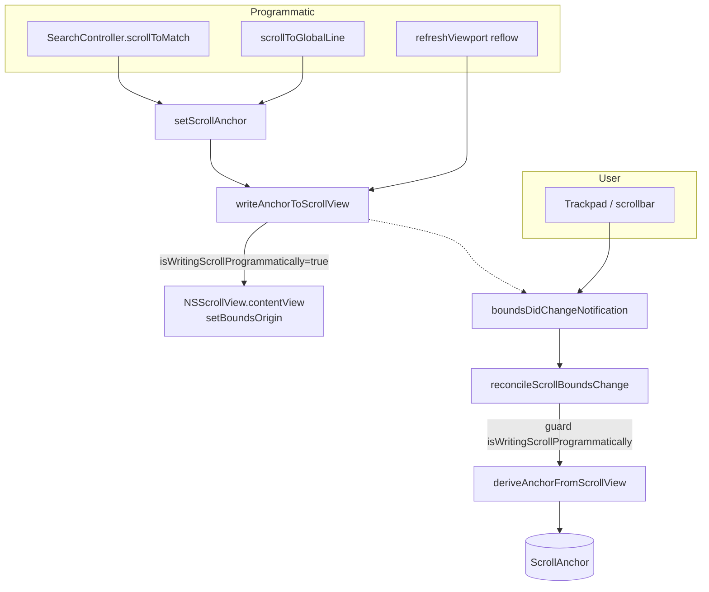
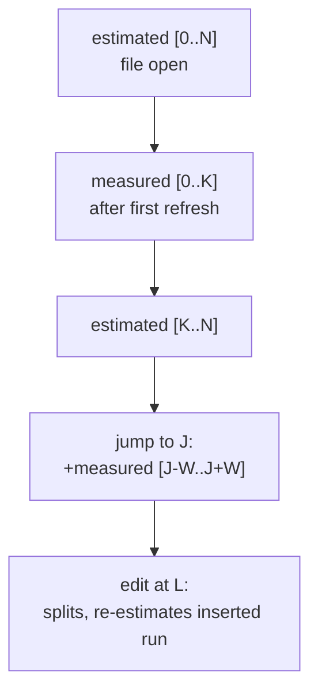

# Editor Geometry & Scrolling

The built-in editor is virtualized: only the visible window of lines (± a 500-line buffer) is loaded into the underlying `NSTextView`. Every line outside the rendered window is still tracked by the geometry layer, so the scrollbar, gotoline, and current-line highlight all read from a single source of truth — modelled on CodeMirror 6's HeightMap + scroll-anchor reflow.

## Component overview

## Line number gutter

`CodeEditorView` returns an `EditorScrollContainer` (NSView), which lays out a `LineNumberGutterView` on the left and the editor's `NSScrollView` on the right. Because the gutter is a *sibling* of the scroll view rather than a subview of it, it is naturally pinned during horizontal scrolls — the user's horizontal motion only moves text inside the scroll view. Vertical sync is driven by the existing `boundsDidChangeNotification` from `scrollView.contentView`: `LineNumberGutterExtension` observes that notification and marks the gutter for redraw. The gutter's `draw(_:)` reads `scrollView.contentView.bounds.origin.y` and projects each logical line's document Y (from `viewport.heightMap.heightAbove(line:)` / `heightOfLine(_:)`) into its own coordinate space, so labels stay aligned with both wrapped and unwrapped layouts and remain correct as estimates are refined into measurements.

## Reflow loop on jump / measurement

`HeightMap` only has *estimated* heights for lines outside the window. Wrapped estimates are still line-addressable: every estimated logical line has its own height and prefix coordinate derived from that line's character count. The first scroll lands at a deterministic line position; rendering measures the new window; the heightmap refines those line heights; the user's logical anchor gets a new pixel position. The reflow loop bumps scroll silently until the geometry settles.

## Write paths

`writeAnchorToScrollView`:
1. Reads the current pixel scroll Y from the anchor.
2. Clamps to `[0, totalDocumentHeight - visibleHeight]`.
3. Sets `isWritingScrollProgrammatically = true` so the user-scroll observer doesn't re-derive the anchor from our own write.
4. Writes `setBoundsOrigin` and clears the flag.

## HeightMap block lifecycle

`HeightMap` keeps the document as a sequence of `Block`s, each either `.measured(lineHeights:)` (exact pixel heights from `layoutManager.boundingRect`) or `.estimated(perLineCharCounts:)` (per-line oracle estimates with a height prefix table).

Edits pass through `replaceLines`, which updates the underlying block sequence and re-estimates inserted lines. Consecutive `.estimated` blocks are merged without losing per-line prefixes.

## Why this works

- **Estimates are per logical line.** A long minified line gets a tall estimate before measurement; a short comment line gets a short one. `heightAbove(line)` and `lineAtY(y)` remain inverse operations for unmeasured wrapped content.
- **Scroll position is not pixel-anchored.** When measurements refine geometry, the anchor's pixel position changes — the reflow loop re-pins it before the user notices.
- **Wrap changes preserve logical anchors.** Toggling wrap or changing the editor width derives the current `ScrollAnchor` before geometry is rebuilt, then re-pins that anchor after TextKit and `HeightMap` are reconfigured.
- **Single source of truth.** Scroll math, jump math, search-jump, and current-line-highlight all derive Y values from the same `HeightMap`.
- **Measurement is pixel-exact.** `recordMeasuredLineHeights` feeds `layoutManager.boundingRect` heights (excluding trailing newline) directly.
