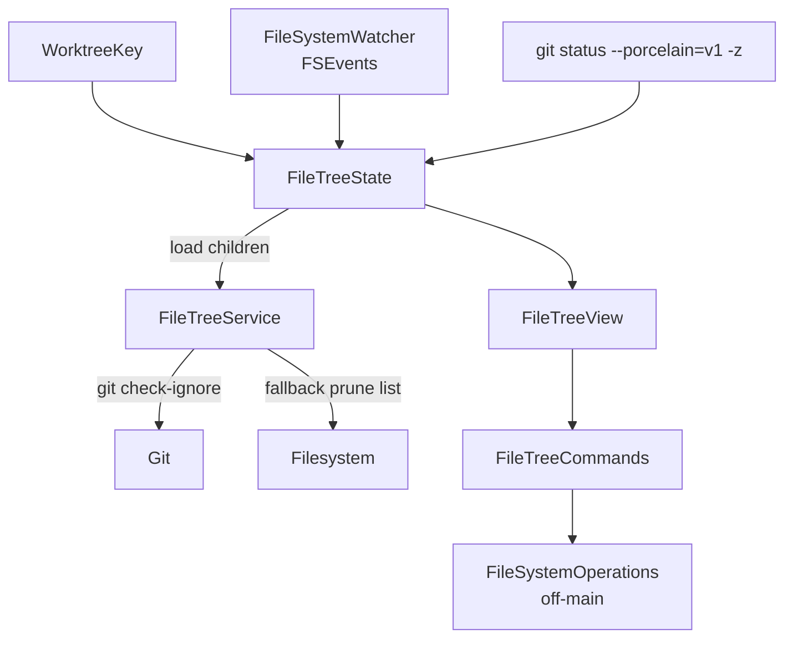

# File Tree

The file tree is a side panel mounted at the trailing edge of the main window — the same slot used by the attached VCS panel. Only one of the two can be visible at a time; opening one closes the other.

## State & data sources

- `FileTreeState` is per `WorktreeKey`, held by `MainWindow`.
- `FileTreeService.loadChildren` is lazy and respects `.gitignore` via `git check-ignore --stdin`. Non-git folders fall back to a hardcoded prune list shared with `FileSearchService`.
- Per-file statuses come from `git status --porcelain=v1 -z`. Modified/renamed → diff hunk color; added/untracked → diff add color; conflict → diff remove color. Parent directories of changed files inherit the modified color. Deleted files are not shown — the tree mirrors the on-disk state.
- The tree subscribes to `.vcsRepoDidChange` and uses `FileSystemWatcher` (FSEvents on the project root, regardless of git status) so external changes refresh without user action. A manual refresh button is also available in the panel header.

## Behaviors

- **Active editor file** is auto-expanded and highlighted via `MuxyTheme.accentSoft`.
- **Show only changes** filters to entries in the status set; directories without changed descendants are hidden.
- **Hide ignored files** — the `FileTreeState.hideIgnoredFiles` toggle drops git-ignored entries, dotfiles, and a built-in noise list (`node_modules`, common lockfiles). It composes with **Show only changes** in `filterVisible`; the selected path and its ancestors stay exempt so `revealFile` always reaches the active editor file. The flag persists globally in `UserDefaults` under `muxy.fileTreeHideIgnoredFiles`.
- **Panel width** persists in `UserDefaults` under `muxy.fileTreeWidth`; expansion state is in-memory only.

## File operations

`FileTreeCommands` (held as view state in `FileTreeView`) drives the flow. It mutates transient `FileTreeState` fields (`pendingNewEntry`, `pendingRenamePath`, `pendingDeletePaths`, `cutPaths`, `dropHighlightPath`, `selectedPaths`, `selectionAnchorPath`) and dispatches to `FileSystemOperations`, a stateless service that runs create / rename / move / copy / trash off the main thread via `GitProcessRunner.offMainThrowing`. Trash uses `NSWorkspace.shared.recycle` so the OS handles Undo.

| Action | Mechanic |
| --- | --- |
| Selection | Plain click selects one; `⌘`-click toggles; `⇧`-click extends range using visible row order. |
| Rename / new entry | Inline `FileTreeRenameField`, commits on Return / blur, cancels on Escape. |
| Cut / copy / paste | `FileClipboard` writes file URLs to `NSPasteboard.general` and tags cuts with `app.muxy.fileCut` so Muxy round-trips cut state while staying interoperable with Finder. |
| Drag & drop | `.fileURL` providers on every directory row + empty space. Hold Option to copy. Drops that move a path into itself are filtered. |
| Path moves | `AppState.handleFileMoved(from:to:)` rewrites every open `EditorTabState.filePath` (exact + descendants of moved dirs). |
| Open in Terminal | Dispatches `.createTabInDirectory` to root a new terminal tab at the selected directory. |

Errors surface through `ToastState.shared` and are also logged.
