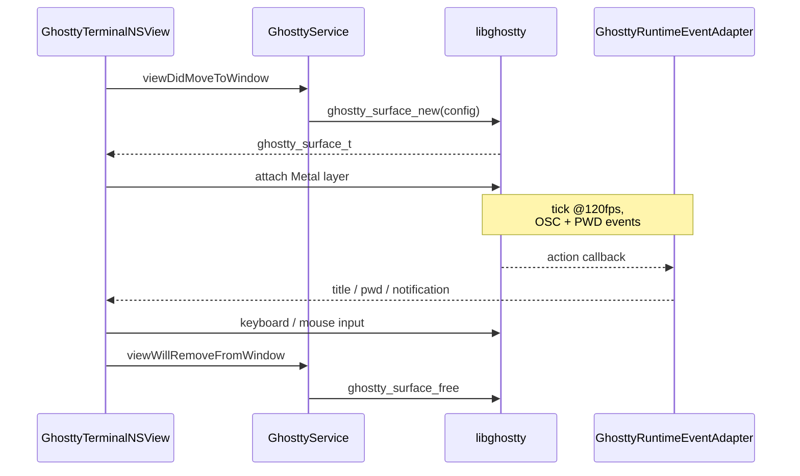

# Ghostty Integration

`GhosttyKit` is a C module wrapping `ghostty.h`. The precompiled static library lives in `GhosttyKit.xcframework/` (gitignored, fetched by `scripts/setup.sh`). See [Building Ghostty](../building-ghostty.md).

## Surface lifecycle

## Components

| Type | Role |
| --- | --- |
| `GhosttyService` (singleton) | Owns the single `ghostty_app_t`. Loads `~/.config/ghostty/config`, runs the 120fps tick timer, handles clipboard callbacks. |
| `GhosttyTerminalNSView` | AppKit `NSView` hosting one `ghostty_surface_t`. Routes keyboard/mouse, owns the Metal layer, bridges to SwiftUI via `GhosttyTerminalRepresentable`. |
| `GhosttyRuntimeEventAdapter` | C callback bridge. Dispatches OSC/desktop-notification + `GHOSTTY_ACTION_PWD` events back to Swift. |
| `TerminalViewRegistry` | Tracks live surfaces; performs `paneID(for:)` reverse lookup for notifications and remote routing. |

## Progress reporting (OSC 9;4)

`GHOSTTY_ACTION_PROGRESS_REPORT` events flow through `GhosttyRuntimeEventAdapter` into `TerminalProgressStore`, keyed by pane ID. The store tracks active progress, records completion-pending state when progress transitions back to `REMOVE`, and aggregates by project for the sidebar dot. Each tab renders a `TerminalProgressCircle` in its trailing slot (the close-button position); hover reveals the close button. Project icons surface a dot until the user opens the completed pane.

## Working-directory tracking

When a user runs `cd` inside a terminal, libghostty emits `GHOSTTY_ACTION_PWD`. `GhosttyRuntimeEventAdapter` forwards that to `TerminalPane`, which updates `TerminalPaneState.currentWorkingDirectory`. The cwd is persisted via `TerminalTabSnapshot`, so reopening the workspace lands each pane in its last-used directory.

## Environment variables

Each surface receives:

| Variable | Purpose |
| --- | --- |
| `MUXY_PANE_ID` | Identifies the pane for notifications / socket routing. |
| `MUXY_PROJECT_ID` | Project owning the pane. |
| `MUXY_WORKTREE_ID` | Worktree owning the pane. |
| `MUXY_SOCKET_PATH` | Path to `muxy.sock` for IPC notifications. |

These are passed via `ghostty_surface_config_s.env_vars` and consumed by the Claude wrapper script and any external tool sending notifications.

## Muxy-specific patches

The fork carries two additive exports used by [Remote Server](remote-server.md) for raw PTY streaming. Details in [Building Ghostty](../developer/building-ghostty.md).

## NSView pitfalls

- Never return a cached/reused `NSView` from `makeNSView` — SwiftUI assumes a fresh view and silently breaks when reused.
- To keep a view alive across tab switches, keep the representable mounted (e.g. ZStack with `opacity(0)` + `allowsHitTesting(false)` for inactive tabs) instead of relying on a registry cache.
- When debugging blank terminal panes, first check whether the `NSView` is being re-mounted from a detached state.
