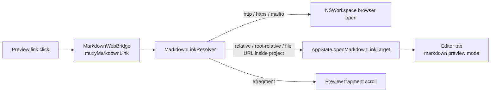

# Markdown Preview

Markdown preview is rendered by `MarkdownWebView`, a SwiftUI bridge over `WKWebView`. The HTML shell comes from `MarkdownRenderer.html(filePath:)`; live content updates are applied through `window.__muxyRenderMarkdown` in `Resources/markdown-assets/markdown-renderer.js` instead of reloading the web view for every edit.

## Link routing

Internal links are resolved against the current markdown file and constrained to the active project root before opening. Root-relative links such as `/docs/guide.md` resolve from the project root. External browser schemes never navigate the embedded web view directly.

Heading fragments are handled in the preview: `markdown-renderer.js` assigns stable slug IDs to headings, and `MarkdownWebBridge` scrolls same-document fragments without leaving the page. Cross-file fragments are stored on `EditorTabState` and applied after the target preview finishes rendering.

## Rendering boundary

The web view only loads the local HTML shell and bundled `muxy-asset://` scripts. Local and remote images are rewritten to custom URL schemes before loading, so image access stays under the markdown preview scheme handlers. Link clicks do not use those image handlers; they are classified by `MarkdownLinkResolver` and then routed either to `NSWorkspace` or to `AppState`.
