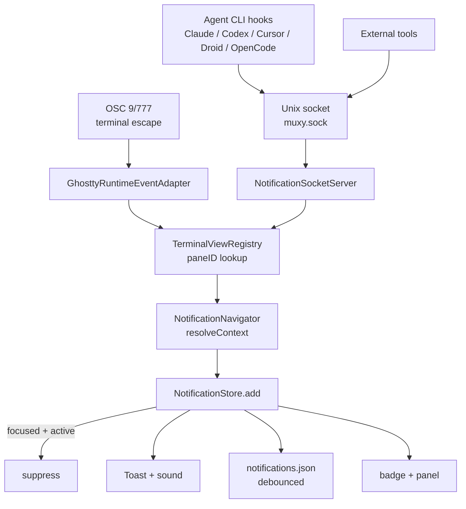

# Notification System

Notifications alert users when terminal events occur (command completion, AI agent messages, OSC escape sequences). Each carries full navigation context so click-to-focus jumps to the originating pane.

## Sources & flow

| Source | Mechanism |
| --- | --- |
| OSC 9 / 777 | `GHOSTTY_ACTION_DESKTOP_NOTIFICATION` in `GhosttyRuntimeEventAdapter`. |
| Agent CLIs (Claude Code, Codex, Cursor, Droid, OpenCode) | `AIProviderRegistry` installs per-tool hook scripts that route lifecycle events through the socket. |
| Unix socket | `~/Library/Application Support/Muxy/muxy.sock`, pipe-delimited messages with paneID. |

## Click-to-navigate

`NotificationNavigator.navigate(to:)` dispatches `selectProject` → `focusArea` → `selectTab` against `AppState`. System notifications encode the navigation context in `userInfo` and bring the app to front on click.

## Pane environment

Every terminal surface receives `MUXY_PANE_ID`, `MUXY_PROJECT_ID`, `MUXY_WORKTREE_ID`, and `MUXY_SOCKET_PATH` via `ghostty_surface_config_s.env_vars`. The Claude wrapper script and any external sender uses these to identify the originating pane.
