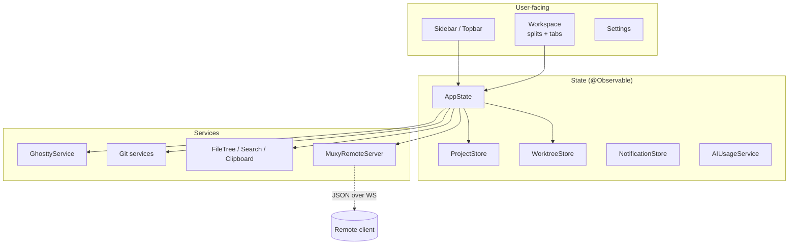

# Architecture Overview

Muxy is a SwiftUI macOS app that uses [libghostty](https://github.com/ghostty-org/ghostty) for terminal emulation and a local-network WebSocket API for companion clients.



## Pages

| Page | What's in it |
| --- | --- |
| [Package Overview](package-overview.md) | Package structure, top-level layout |
| [State Management](state-management.md) | AppState, reducer, persistence, navigation history |
| [Ghostty Integration](ghostty-integration.md) | GhosttyService, surface lifecycle, runtime events |
| [Editor Geometry](editor-geometry.md) | HeightMap + scroll-anchor reflow |
| [Markdown Preview](markdown-preview.md) | WKWebView rendering, link routing, image schemes |
| [File Tree](file-tree.md) | Lazy tree, git-status colors, file ops |
| [VCS](vcs.md) | Source Control tab, PR flow |
| [Notifications](notifications.md) | Sources, routing, click-to-navigate |
| [UI Scaling](ui-scaling.md) | Centralized chrome metrics with user-adjustable scale |
| [AI Usage](ai-usage.md) | Provider registry, credentials, refresh lifecycle |
| [Remote Server](remote-server.md) | WebSocket server, terminal streaming, pairing |
| [CLI & URL Scheme](cli-and-url-scheme.md) | `muxy` wrapper, `muxy://` URL, socket entry |
| [Updates](updates.md) | Sparkle channels and release flow |

## Top-level hierarchy

```
Project → Worktree → SplitNode (splits/tab areas) → TerminalTab → Pane
```

Workspace state is keyed by `WorktreeKey(projectID, worktreeID)` in `AppState`, so every per-project map is per-worktree. `AppState.activeWorktreeID[projectID]` tracks the visible worktree per project. Each project has at least one **primary** worktree pointing at `Project.path`; git projects can attach more.
