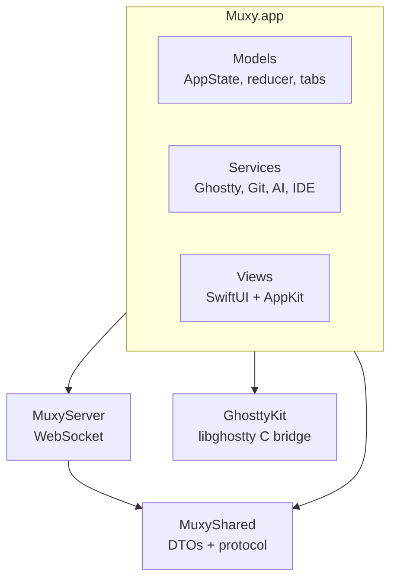

# Package Overview

## Top-level packages

| Package | Role |
| --- | --- |
| `Muxy/` | Desktop app (SwiftUI). Models, Services, Views. |
| `MuxyShared/` | Wire DTOs, protocol enums, JSON envelope/codec. |
| `MuxyServer/` | WebSocket server (NWListener) embedded in the app. |
| `GhosttyKit/` | C module wrapping `ghostty.h`; xcframework lives outside the repo. |

## Muxy/ directory map

| Folder | Contents |
| --- | --- |
| `Commands/` | Menu bar commands (`MuxyCommands`). |
| `Models/` | `AppState`, `WorkspaceReducer`, tabs, splits, navigation history, layout config. |
| `Services/` | Ghostty, Git, file tree, AI usage, notifications, mobile server, persistence. |
| `Services/Providers/` | Per-AI-provider integrations (Claude, Codex, Copilot, Cursor, …). |
| `Services/Git/` | Repository, worktree, diff parsing, signposts. |
| `Syntax/` | Tokenizer, theme mapping, per-language grammars. |
| `Theme/` | Color system derived from Ghostty palette. |
| `Views/` | SwiftUI + AppKit views: workspace, terminal, editor, VCS, sidebar, settings. |

## MuxyShared

Platform-agnostic, all `Codable` + `Sendable`:

- **DTOs**: `ProjectDTO`, `WorktreeDTO`, `WorkspaceDTO` (and the `SplitNodeDTO` / `TabAreaDTO` / `TabDTO` tree), `NotificationDTO`, `VCSStatusDTO`.
- **Protocol**: `MuxyProtocol` enums (methods, results, events), `ProtocolParams`.
- **Envelope**: `MuxyMessage` (request/response/event) and `MuxyCodec` (ISO-8601 dates).

## MuxyServer

`MuxyRemoteServer` listens on `NWListener` with the WebSocket protocol. `ClientConnection` wraps a per-client `NWConnection`. The server delegates auth and request dispatch to a `MuxyRemoteServerDelegate` implemented by `MobileServerService` against `AppState` & friends. See [Remote Server](remote-server.md) for the full picture.
