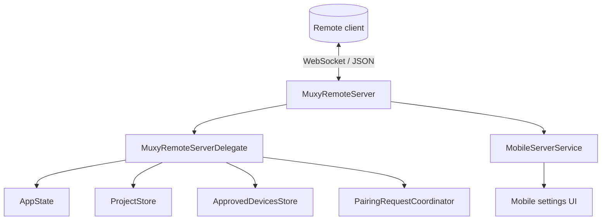
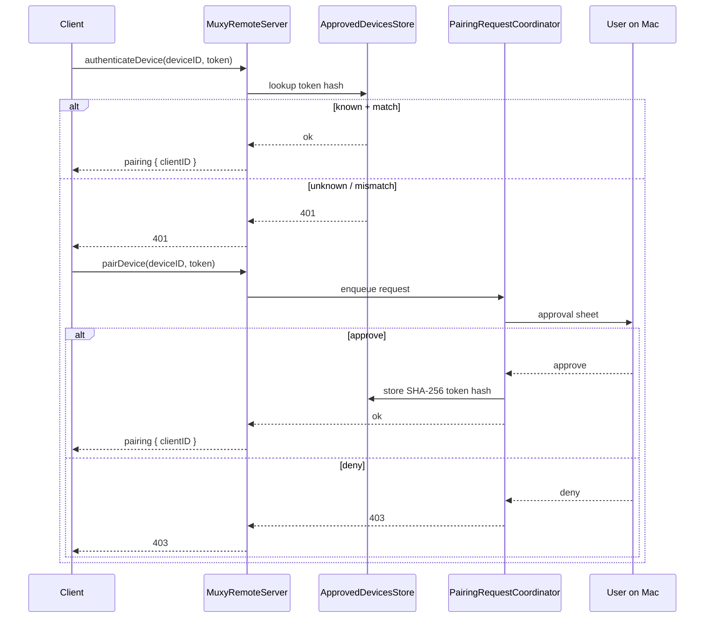
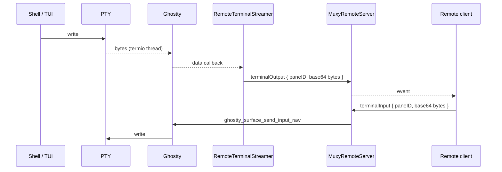

# Remote Server (MuxyServer)

The desktop app embeds a WebSocket server (`MuxyRemoteServer`) that exposes workspace state and terminal operations to remote clients (e.g. the MuxyMobile companion app) over the local network. The user-facing wire protocol is documented in [Remote Server API docs](../remote-server/overview.md).

## Architecture

The server uses Apple's Network framework (`NWListener` + `NWConnection`) with the WebSocket protocol. All messages use the `MuxyMessage` JSON envelope from `MuxyShared`. The user-configurable port (default 4865) is stored in `UserDefaults` and applied on start. `MobileServerService` reports bind failures back to the UI: if the listener fails (e.g. port in use), the enable toggle is rolled off and the settings view displays the error.

## Pairing handshake

After success, the client is added to an `authenticatedClients` set on `MuxyRemoteServer`; broadcasts only go to clients in that set. Until the handshake succeeds the server rejects every other RPC with `401`. The `Mobile` tab in Settings lists approved devices with a Revoke action; revoke removes the device from `approved-devices.json` and terminates active connections via `MuxyRemoteServer.disconnect(deviceID:)`.

A token mismatch is treated the same as unknown (returns `401`) so a stolen but outdated credential can't resume authentication.

## Terminal I/O streaming

Terminal traffic flows as raw PTY bytes, not rendered cells. This relies on two additive exports on the `muxy-app/ghostty` fork (see [Building Ghostty](../building-ghostty.md)):

- `ghostty_surface_set_data_callback(surface, cb, userdata)` — per-surface callback invoked on the termio thread on every chunk of bytes from the PTY, before Ghostty's emulator parses them.
- `ghostty_surface_send_input_raw(surface, ptr, len)` — writes bytes directly to the PTY, bypassing the paste pipeline (no bracketed-paste wrapping, no newline filtering, no keyboard-protocol interpretation).

`RemoteTerminalStreamer` registers the data callback on every terminal surface at creation (`GhosttyTerminalNSView.createSurface`), unregisters on teardown, and forwards bytes as `terminalOutput` events targeted at the owning client via `MuxyRemoteServer.send(_:to:)`. The event payload is a `TerminalOutputEventDTO` containing the paneID and a `Data` of raw bytes (base64-encoded on the JSON wire).

## Workspace and projects broadcasts

`RemoteServerDelegate` uses `withObservationTracking` to watch `AppState` and `ProjectStore`. Two independent observers re-arm on every change:

- The workspace observer reads the current `WorkspaceDTO` for each project that has an active worktree, which transitively touches the observable properties referenced by the DTO (split tree, tab list, titles, pin state, active tab). Any change schedules a debounced (~80 ms) broadcast that emits one `workspaceChanged` event per active project to all authenticated clients.
- The projects observer reads `projectStore.projects` and emits a single `projectsChanged` event with the full list when anything in it mutates.

Debouncing coalesces bursts (e.g. dragging a split divider, rapid tab cycling) into a single push. Coverage is whatever the snapshot reads — today this includes paths that bypass `AppState.dispatch` (terminal-driven title updates via `TerminalPaneState.setTitle`, view-layer mutations like `TabArea.setCustomTitle`, `togglePin`, `reorderTab`). New observable fields on the workspace tree need to flow through `WorkspaceDTO` (or a tracking helper) to be picked up by the broadcaster.
