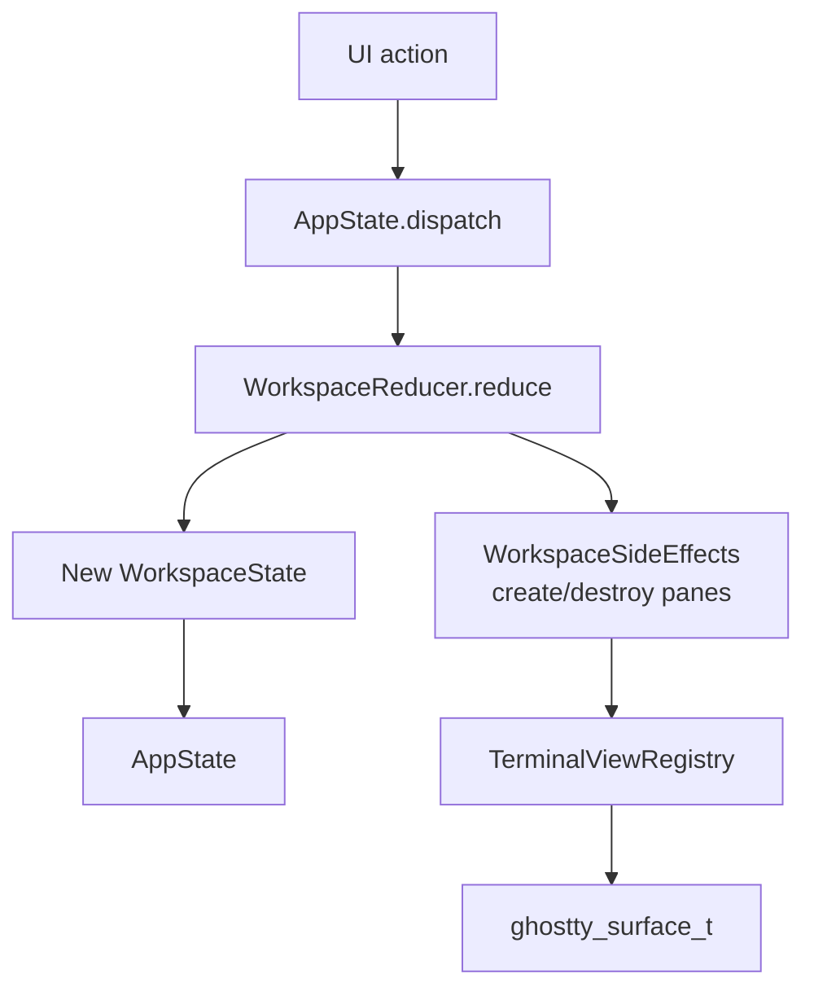
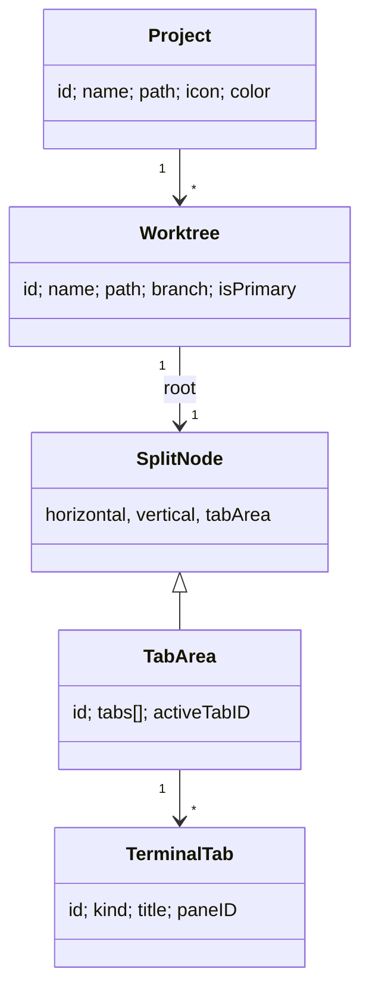

# State Management

`AppState` is the `@Observable` root that holds projects, worktrees, and per-worktree workspace trees. All mutations route through a pure reducer.

## Data flow

## Hierarchy

A workspace tree is keyed by `WorktreeKey(projectID, worktreeID)`. `AppState.activeWorktreeID[projectID]` tracks the visible worktree per project.

## Pane maximize state

`AppState.maximizedAreaID` stores the temporarily maximized pane per `WorktreeKey`. It is presentation state, not persisted workspace state: the split tree stays intact while `TerminalArea` renders only the selected `TabArea`.

When a pane is maximized, tab shortcut offsets are scoped to that pane so `⌘1…9` selects visible tabs only. The maximize state is cleared when the workspace is no longer split, the maximized area disappears, focus moves to another area, or the maximized pane is split.

## Persistence

| File | Contents |
| --- | --- |
| `~/Library/Application Support/Muxy/projects.json` | Project list, including optional preferred worktree parent. |
| `~/Library/Application Support/Muxy/worktrees/{projectID}.json` | Per-project worktrees (managed vs externally discovered). |
| `~/Library/Application Support/Muxy/workspaces.json` | Tab/split snapshots, terminal cwds, custom titles + colors. |
| `~/Library/Application Support/Muxy/keybindings.json` | Remapped keyboard shortcuts. |
| `~/Library/Application Support/Muxy/command-shortcuts.json` | Custom command shortcuts + layered prefix state. |
| `~/Library/Application Support/Muxy/notifications.json` | Notification history (debounced writes). |
| `~/Library/Application Support/Muxy/approved-devices.json` | Approved mobile clients (deviceID + token hash). |
| `~/Library/Application Support/Muxy/ghostty.conf` | Effective Ghostty config (seeded from `~/.config/ghostty/config`). |

`JSONFilePersistence` is the shared App Support directory helper. `WorktreeLocationResolver` chooses where new worktrees live: per-project preference → `muxy.general.defaultWorktreeParentPath` setting → app-support fallback. Externally discovered worktrees are never touched by Muxy's `cleanupOnDisk` paths.

## Navigation history

`AppState` owns a `NavigationHistory` that stacks `(projectID, worktreeID, areaID, tabID)` tuples after every `dispatch`. `goBack()` / `goForward()` validate the target still exists and skip stale entries. The `Action.navigate(...)` case keeps all mutations in the reducer; `performWithRecordingSuppressed` prevents the back/forward step from re-recording.

Triggers: `⌃⌘←` / `⌃⌘→`, mouse buttons 3/4, Magic Mouse / 3-finger trackpad horizontal swipe. The handler is gated on the focused window being a Muxy main window.

## Window title

`NSWindow.title` is hidden visually (`titleVisibility = .hidden`) but `WindowTitleUpdater` keeps it set to `{project} — {tab title}` so accessibility readers and trackers (e.g. ActivityWatch) can identify sessions. Tab titles follow OSC 0/2 unless the user sets `TerminalTab.customTitle` (`⌃⌘R`).
