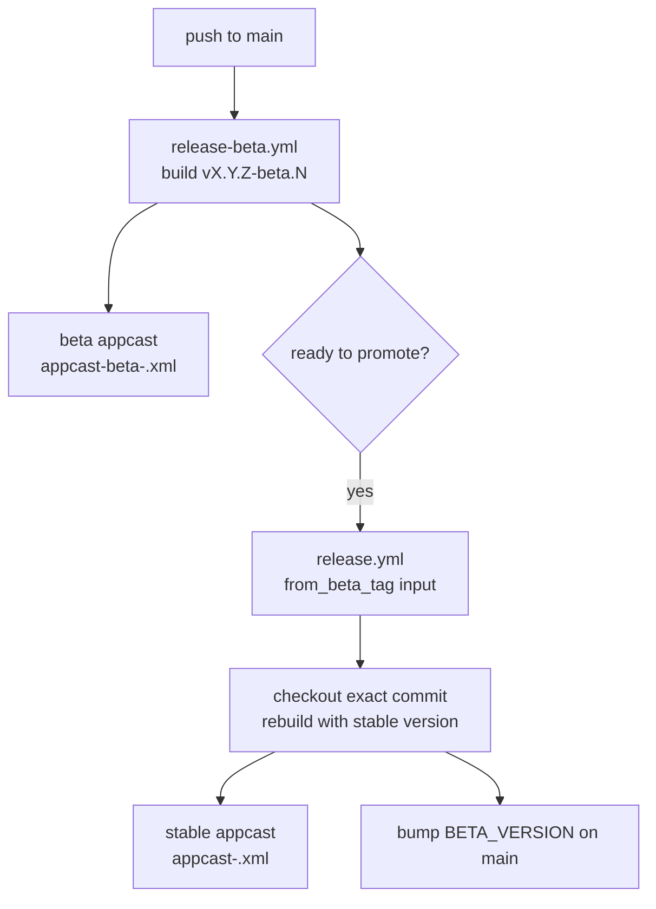

# Updates

Sparkle drives in-app updates via `UpdateService`. There are two channels: **stable** and **beta**.

## Channels

| Channel | Source | Tag pattern | Appcast |
| --- | --- | --- | --- |
| stable | manual `release.yml` | `vX.Y.Z` | `releases/latest/download/appcast-<arch>.xml` |
| beta | auto `release-beta.yml` per push to `main` | `vX.Y.Z-beta.<buildNumber>` (X.Y.Z from `BETA_VERSION` at repo root) | `releases/download/beta-channel/appcast-beta-<arch>.xml` |

Each channel's appcast accumulates only its own items, so release notes are isolated. The user-selected channel is persisted in `UserDefaults["muxy.update.channel"]` and routed at runtime via `SPUUpdaterDelegate.feedURLString(for:)` — the baked-in feed URL is just the default fallback.

## Stable = promoted beta

Stable releases are produced by **promoting a beta tag**: `release.yml` takes a `from_beta_tag` input (e.g. `v0.26.0-beta.42`), checks out that exact commit, and rebuilds with the stable version string. Stable users receive the exact bits beta testers validated, while `main` keeps accepting merges throughout. After publishing, the workflow bumps `BETA_VERSION` on `main` so subsequent betas target the next planned stable.
