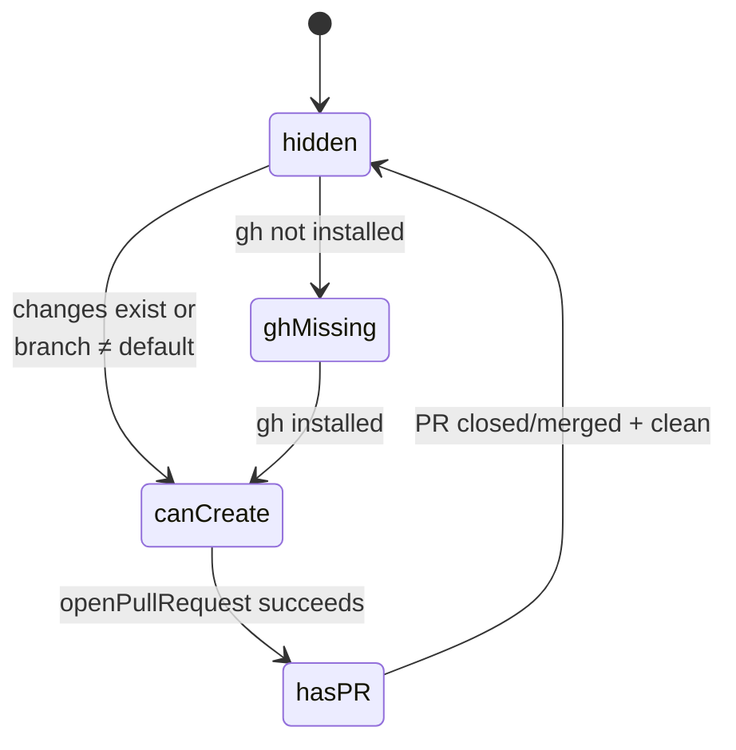
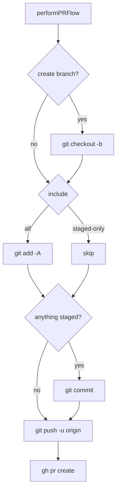

# Source Control

The VCS tab is organized top-to-bottom as:

1. **Header** — worktree trigger, branch picker, `PRPill`, settings, refresh.
2. **Commit area** — commit message field + `Commit` (`⌘↵`), `Pull` (`↓N` badge when behind), `Push` (`↑N` when ahead).
3. **Sections** — Staged / Changes / History / Pull Requests, vertically resizable.

## PR pill states

- `hidden` — clean tree on default branch, or loading. Pill not rendered.
- `ghMissing` — disabled pill prompting to install `gh`.
- `canCreate` — "Create PR" button opens `CreatePRSheet`.
- `hasPR(info)` — pill opens `PRPopover` with state, base, mergeability, and Open / Merge / Close / Refresh actions.

## Create PR flow

`CreatePRSheet` builds a `PRCreateRequest` passed to `VCSTabState.openPullRequest`. The form:

1. **Target branch** — from `GitRepositoryService.listRemoteBranches`, defaulting to the repo's default branch.
2. **Title + description** — both blank.
3. **Branch strategy** — radio between "use current branch" (hidden when on the default branch or current == target) and "create new branch" (auto-slugs from title until edited).
4. **Include** — "all changes" (default) or "only staged"; hidden when there are no changes or only one kind.
5. **Draft** — adds `--draft` to `gh pr create`.

No rollback on partial failure — errors surface to the sheet so the user retries from where it stopped. Ahead/behind counts come from `GitRepositoryService.aheadBehind`.

## Worktree auto-refresh

`VCSWorktreeAutoRefresher` keeps `WorktreeStore` aligned with `git worktree list` without a manual click. It listens for two notifications, both keyed by `userInfo["repoPath"]`:

- `.vcsDidRefresh` — posted by `VCSTabState` after every full refresh.
- `.vcsRepoDidChange` — posted by `RemoteServerDelegate` on remote-driven repo changes.

On a hit, it resolves the repo path to a project via `WorktreeStore.projectID(forWorktreePath:)` and runs `WorktreeRefreshHelper.refresh` with `presentErrors: false` (failures log to `os.Logger`, no alert). A per-project in-flight guard coalesces overlapping notifications into a single trailing refresh.

## Pull Requests section

Independent from the rest of VCS; never auto-fetches with the file/branch refresh. Exposes search, a state filter (Open/Closed/Merged/All), a manual sync button, and an auto-sync interval (Off / 5m / 15m / 30m / 1h) persisted per-repo at `UserDefaults["vcs.prAutoSyncMinutes.<repoPath>"]`.

`VCSTabState.loadPullRequests` calls `GitRepositoryService.listPullRequests` which shells out to `gh pr list --json …`. Selecting a PR row triggers `gh pr checkout <number>` via `checkoutPullRequest`; if the working tree is dirty, `VCSTabView` first presents an NSAlert confirmation. After checkout, the tab refreshes branches, files, and PR info.
