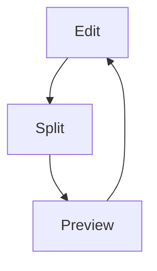

# Editor

Muxy includes a lightweight built-in code editor that opens files as tabs. Designed for quick edits in the same workspace as your terminals — not as a replacement for a full IDE.

## Opening files

| How | Notes |
| --- | --- |
| `⌘P` (Quick Open) | Fuzzy file search over the active worktree |
| `⌘⇧F` (Find in Files) | Search text across the active project |
| File tree → click / right-click → Open | Editor tab for the file |
| File menu → Open File… | Standard open panel |
| Drag a file from Finder | Drop on the tab bar |

## Editing

- Standard macOS text editing shortcuts.
- **Save:** `⌘S` · **Undo / Redo:** `⌘Z` / `⌘⇧Z`.
- Unsaved changes are tracked per tab; quitting with unsaved files prompts to **Save All / Cancel / Discard**.

## Syntax highlighting

The editor highlights 30+ languages including Swift, C / C++ / Objective-C, JavaScript / TypeScript, Python, Ruby, Go, Rust, HTML / CSS, JSON / YAML / TOML, Markdown, and shell scripts. The active syntax theme follows the app theme — change it in **Settings → Appearance**.

## Find / Replace

`⌘F` opens find within the editor. `⌘⌥F` opens find and replace.

## Markdown preview

Markdown files (`.md`, `.markdown`) get a live preview pane. Toggle modes from the editor toolbar:

- **Edit only**
- **Preview only**
- **Split** — editor and preview side-by-side with synchronised scrolling.

Preview features: GitHub-flavoured Markdown, Mermaid diagrams, local + remote images, clickable heading anchors, internal file links that open in markdown preview tabs, and external links that open in the browser.

Remote images can be disabled in **Settings -> Editor -> Markdown Preview**.

Zoom: `⌘=`, `⌘-`, `⌘0`.

## Line wrapping

Opt-in line wrapping is available in the editor toolbar. The editor uses a virtualized HeightMap so wrapped long files stay smooth at large sizes — see [Editor Geometry](../architecture/editor-geometry.md) for the internals.

## External editor

If you prefer your own editor, **Settings → Editor** lets you set a default external editor command. Quick Open and file-tree double-click then route to that command instead of the built-in editor.

Terminal Command launches through the user's login interactive shell, matching commands typed into a normal Muxy terminal tab.
