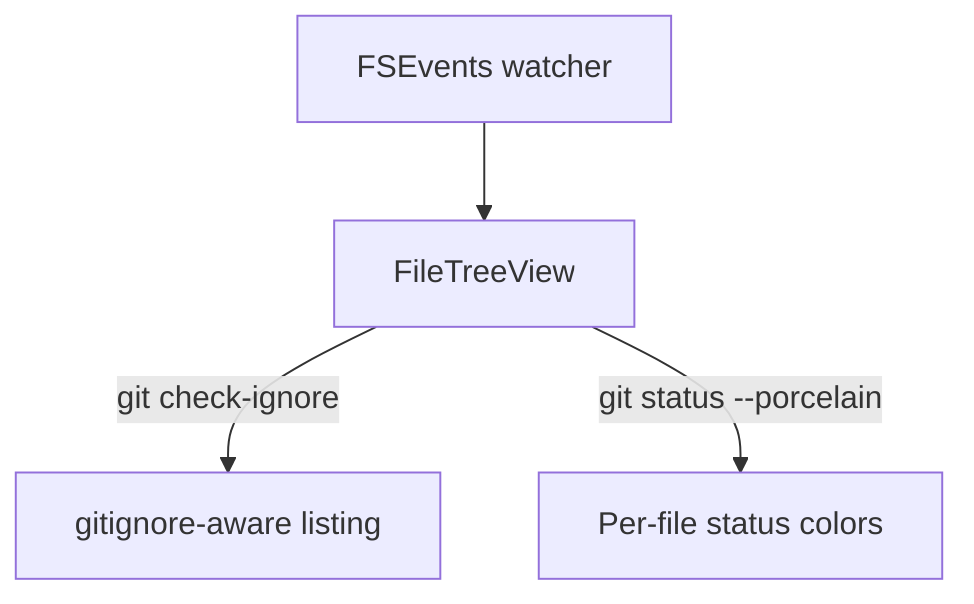

# File Tree

A side panel showing the active worktree's directory structure. Toggle with `⌘E`.

Only one of the file tree or attached VCS panel is visible at a time — opening one closes the other.

## What it shows

- Lazy-loaded directories — children load when you expand a folder.
- `.gitignore` is respected via `git check-ignore`.
- **Hide ignored files** — a panel-header toggle that hides git-ignored entries, dotfiles, `node_modules`, and lockfiles. Off by default; the choice is remembered across sessions. The file open in the editor stays visible even when it matches a rule.
- **Show only changes** filters to files with git changes.
- The active editor file is highlighted; its parent folders auto-expand.

## Git status colors

Files are colored by git status: modified, added, untracked, deleted. Folders inherit a status hint from their descendants.

## File operations

| Action | How |
| --- | --- |
| New File / New Folder | Inline text field on the parent folder |
| Rename | Double-click, or right-click → Rename |
| Delete | Moves to Trash via `NSWorkspace.recycle` (so OS handles Undo) |
| Cut / Copy / Paste | System pasteboard with a Muxy cut marker |
| Reveal in Finder | Right-click |
| Open in Terminal | New terminal tab rooted at that directory |

Multi-select with `⌘`-click and `⇧`-click. Drag and drop moves; hold `⌥` while dragging to copy.

## External changes

A FSEvents watcher picks up changes made outside Muxy — no manual refresh needed.

## Resizing

Panel width is draggable and persists in `UserDefaults` (`muxy.fileTreeWidth`).
