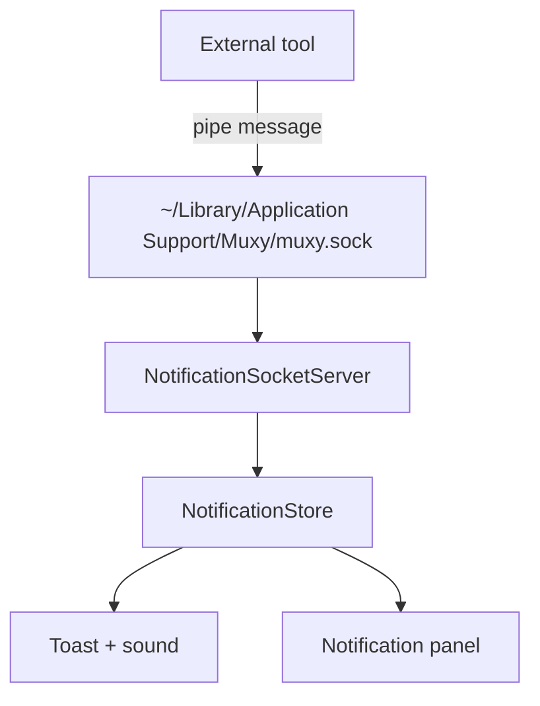

# Notification Setup

Muxy ships built-in integrations for **Claude Code**, **Codex**, **Cursor**, **Droid**, and **OpenCode** — toggle them under **Settings → Notifications**. This page is for everything else: sending notifications into Muxy from any other tool (a custom CLI, a build script, a different AI agent, …).



## Socket location

Muxy listens on a Unix domain socket:

```
~/Library/Application Support/Muxy/muxy.sock
```

The path is exported to every Muxy terminal as `MUXY_SOCKET_PATH`, with a per-pane identifier `MUXY_PANE_ID`. Any process running inside a Muxy pane can read these and send a message.

## Wire format

One message per connection: a single UTF-8 line with four pipe-separated fields:

```
<type>|<paneID>|<title>|<body>
```

| Field | Required | Description |
| --- | --- | --- |
| `type` | yes | Source identifier. Unknown values are accepted and shown generically. Built-in: `claude_hook`, `codex_hook`, `cursor_hook`, `droid_hook`, `opencode`. |
| `paneID` | yes | Pane the event belongs to. Use `$MUXY_PANE_ID` from inside a Muxy terminal. Leave empty to attach to the active pane. |
| `title` | yes | Notification title. Empty falls back to `Task completed!`. |
| `body` | no | Body. Must not contain `\|` or newlines — replace them first. |

Limits:

- Max message size: **64 KB**.
- Newlines terminate a message; you can send multiple by separating them with `\n`.

## Examples

### Shell

```bash
printf '%s|%s|%s|%s' \
  "custom" "$MUXY_PANE_ID" "Build finished" "All tests passed" \
  | nc -U "$MUXY_SOCKET_PATH"
```

Reusable function:

```bash
muxy_notify() {
  [ -z "${MUXY_SOCKET_PATH:-}" ] && return 0
  local title="${1:-Done}" body="${2:-}" safe_body
  safe_body=$(printf '%s' "$body" | tr '|\n\r' '   ' | head -c 500)
  printf '%s|%s|%s|%s' "custom" "${MUXY_PANE_ID:-}" "$title" "$safe_body" \
    | nc -U "$MUXY_SOCKET_PATH" 2>/dev/null || true
}

long-running-build && muxy_notify "Build finished" "main @ $(git rev-parse --short HEAD)"
```

### Node.js

```javascript
import { createConnection } from "net"

function muxyNotify(title, body = "") {
  const socketPath = process.env.MUXY_SOCKET_PATH
  const paneID = process.env.MUXY_PANE_ID || ""
  if (!socketPath) return
  const safeBody = String(body).replace(/[\n\r|]+/g, " ").slice(0, 500)
  const payload = `custom|${paneID}|${title}|${safeBody}`
  const conn = createConnection({ path: socketPath })
  conn.on("error", () => {})
  conn.write(payload, () => conn.end())
}
```

### Python

```python
import os, socket

def muxy_notify(title: str, body: str = "") -> None:
    path = os.environ.get("MUXY_SOCKET_PATH")
    pane = os.environ.get("MUXY_PANE_ID", "")
    if not path:
        return
    safe_body = body.replace("|", " ").replace("\n", " ")[:500]
    payload = f"custom|{pane}|{title}|{safe_body}".encode("utf-8")
    with socket.socket(socket.AF_UNIX, socket.SOCK_STREAM) as s:
        s.connect(path)
        s.sendall(payload)
```

## Reference implementations

The built-in integrations are good templates:

- **Shell hook (Claude Code):** [`Muxy/Resources/scripts/muxy-claude-hook.sh`](../../Muxy/Resources/scripts/muxy-claude-hook.sh)
- **Node plugin (OpenCode):** [`Muxy/Resources/scripts/opencode-muxy-plugin.js`](../../Muxy/Resources/scripts/opencode-muxy-plugin.js)

## Tips

- **Fire and forget.** If Muxy isn't running or the socket doesn't exist, the connection will fail — swallow the error rather than crashing.
- **Don't block.** Open, write, close. Muxy doesn't send a response.
- **Sanitize.** Strip `|`, `\n`, `\r` from user/model-generated content; cap body length (200–500 chars is plenty).
- **Pane routing.** From outside a Muxy pane (e.g. cron), omit `paneID`; Muxy routes to the active pane.

## Delivery settings

Muxy respects user choices under **Settings → Notifications**: toast on/off, position (top/bottom), sound. A dot also appears on the project and worktree rows in the sidebar until the notification is read.
