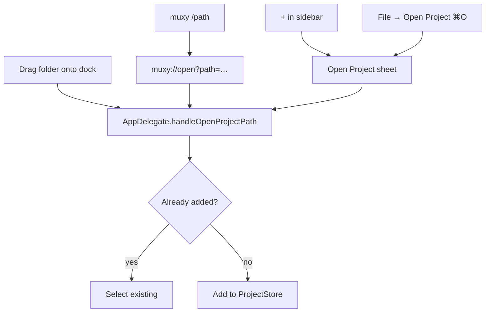

# Projects

A project is a directory plus a bit of metadata: name, logo, icon color, last-used IDE, tabs, splits, and worktrees.

## Adding a project

| Entry point | How |
| --- | --- |
| Sidebar | Click **+** at the bottom |
| Menu | **File → Open Project…** (`⌘O`) |
| Dock | Drag a folder onto the Muxy icon |
| Shell | `muxy /path/to/project` (after **Muxy → Install CLI**) |
| URL | `muxy://open?path=/path/to/project` |

All entry points dedupe — opening the same path twice activates the existing project.

## Customising appearance

Right‑click a project in the sidebar:

- **Set Logo...** — use a cropped image as the project icon.
- **Set Icon Color...** — choose the fallback letter badge color.
- **Rename Project** — display name only; doesn't move the folder.
- **Remove** — removes from Muxy; folder on disk is left alone.

## Switching projects

| Action | Shortcut |
| --- | --- |
| Next / Previous | `⌃]` / `⌃[` |
| Project 1–9 | `⌃1…9` |
| Pick from sidebar | Click |

Each project keeps its own tabs, splits, and active tab in memory while the app is running.

## Project workspaces

Use the workspace menu at the top of the sidebar to filter projects into named groups. See [Project Workspaces](project-workspaces.md).

## Open in IDE

Muxy auto‑discovers IDE‑like apps installed on your Mac (VS Code, Zed, Sublime, JetBrains IDEs, Cursor, …). The **Open in IDE** topbar button and **File → Open in IDE** menu show what was found and remember your last choice. If an editor tab is active, the IDE is launched at that file's line and column when supported.

## Persistence

Projects live at `~/Library/Application Support/Muxy/projects.json`. Workspace snapshots and terminal sessions are saved separately so Muxy can restore the last shape of a project.

## Settings

- **General → Keep projects open after closing all tabs** — keeps an empty project in the sidebar.
- **General → Auto‑expand worktrees on project switch** — opens the worktree list when you switch projects.
