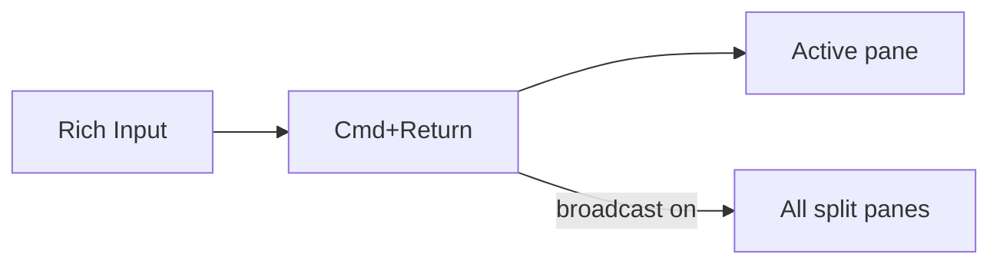

# Rich Input

Rich Input is a prompt composer for terminal panes. Open it with `Cmd+I` or the status bar keyboard button.

Use it when a command or AI prompt is too large for a terminal line.

## Send flow

## What it can send

- Multiline text.
- Dropped or pasted file paths.
- Pasted or dropped images.
- Text plus files or images in one send.

`Cmd+Return` sends and presses Return. `Cmd+Shift+Return` inserts without Return.

## Images

Choose image handling in **Settings -> Editor -> Rich Input**:

| Mode | Result |
| --- | --- |
| Clipboard | Paste images through the terminal clipboard path |
| Inline Path | Replace image placeholders with escaped file paths |

## Panel controls

| Control | What it does |
| --- | --- |
| Broadcast | Send to every split pane in the active workspace |
| Pin | Float or dock the panel |
| Position | Move between right side and bottom |

Draft text and attachments are saved per worktree.

## Voice input

`Cmd+Shift+I` opens voice recording. Muxy transcribes on-device and inserts the transcript into Rich Input or the last focused terminal target. See [Voice Recording](voice-recording.md).
