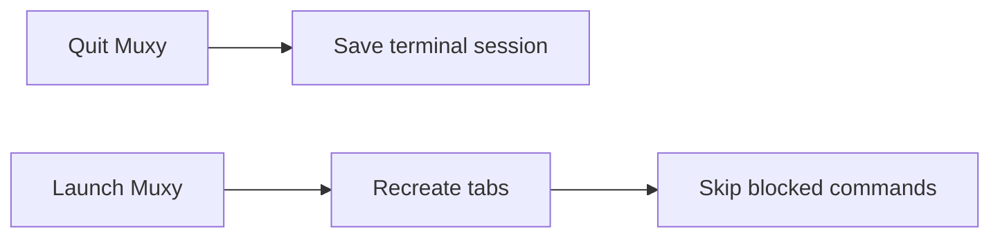

# Session Restore

Muxy can restore terminal tabs after restart.

It saves terminal sessions on quit and recreates them when the project opens again.

## What restores

- Terminal tabs.
- Working directory when shell integration reports it.
- Last submitted command when it is safe to replay.

Editor, diff, and source-control tabs are workspace state, not terminal session restore.

## Settings

Open **Settings -> Sessions**:

- **Restore Terminal Sessions** enables or disables restore.
- **Blocked Commands** are never restored automatically.

Keep risky commands in the blocked list, such as deploys, destructive scripts, or long-running one-off jobs.
