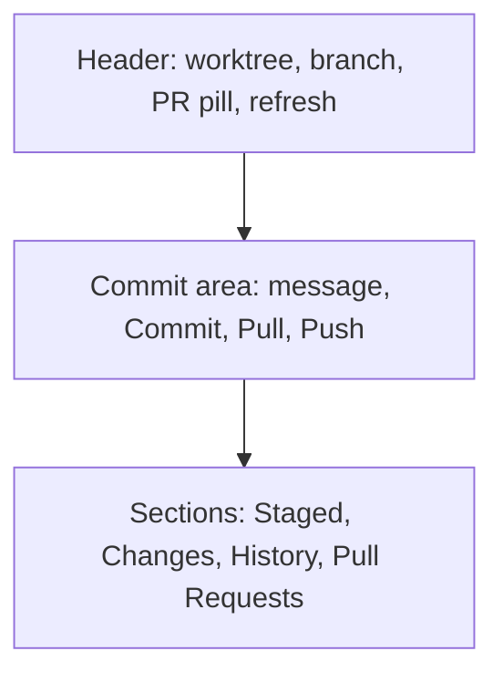

# Source Control

A full git UI for the active worktree. Open with `⌘K`, or **File → Source Control**.

## Display modes

Configurable in **Settings → General**:

| Mode | Where it appears |
| --- | --- |
| Tab | Regular workspace tab |
| Attached | Side panel on the main window |
| Window | Separate "Source Control" window (id `vcs`) |

## Status

Files are grouped into **Staged**, **Changes** (modified, tracked), and **Untracked**. Toggle between flat list and folder tree. Stage/unstage individual files or whole directories. Discard is in the right-click menu.

## Diffs

Click a file to see its diff inline. Supports:

- **Unified** and **Split** views (toolbar toggle).
- Syntax highlighting.
- Collapsible context lines.
- Hover blame (toggle on) showing author and date for each line.

For deeper inspection, **Open in Diff Viewer** opens the file as a standalone diff tab.

## Commit, push, pull

- Type a message in the commit box; **Commit** with `⌘↵`. Auto-stage toggle picks up unstaged changes when enabled.
- Use the sparkle button to generate a commit message with the configured AI assistant.
- **Push** uploads to the upstream branch; shows ↑N when ahead. Pushing a branch with no upstream prompts to set one.
- **Pull** fetches and merges; shows ↓N when behind.

## Branches & worktrees

The branch dropdown switches branches (refused if there are uncommitted changes). **Create Branch…** creates and checks out a new branch. The worktree picker is shared with the topbar — see [Worktrees](worktrees.md).

## Pull requests

If `origin` is on GitHub and `gh` is authenticated, Muxy shows:

- **PR pill** in the header (state, base, mergeability).
- **Pull Requests** section with search, state filter (Open/Closed/Merged/All), and manual or interval-based auto-sync (Off / 5m / 15m / 30m / 1h).
- **Create PR…** sheet with branch strategy, draft toggle, and "Open in browser after creation".
- **Generate with AI** drafts the PR title and body from the branch diff.
- Per-PR actions: open on GitHub, merge, close, refresh.

## History

The Commit History section lists recent commits chronologically. Right-click a commit for **Show Diff**, **Copy Hash**, etc.

## Layout

Staged / Changes / History / Pull Requests are vertically resizable; their split ratios persist per project.
