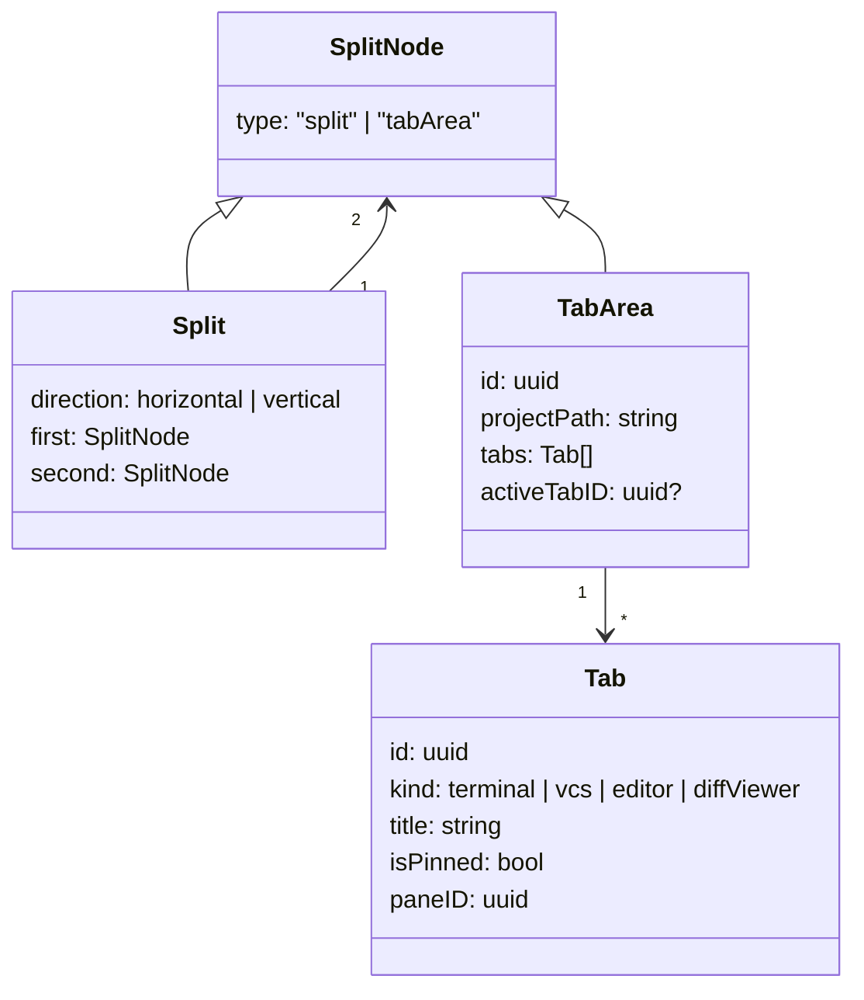

# Data Objects

## Project

```json
{
  "id": "uuid",
  "name": "muxy",
  "path": "/Users/example/project",
  "sortOrder": 0,
  "createdAt": "2026-04-19T10:00:00Z",
  "icon": "hammer",
  "logo": "custom",
  "iconColor": "#7C3AED"
}
```

## Worktree

```json
{
  "id": "uuid",
  "name": "main",
  "path": "/Users/example/project",
  "branch": "main",
  "isPrimary": true,
  "canBeRemoved": false,
  "createdAt": "2026-04-19T10:00:00Z"
}
```

## Workspace

A workspace contains:

- `projectID`
- `worktreeID`
- `focusedAreaID`
- `root` — recursive tree node

`root` has two node types:



`paneID` is required for terminal-related methods.

## Terminal snapshot

`getTerminalContent` returns a full terminal grid:

```json
{
  "paneID": "uuid",
  "cols": 120,
  "rows": 40,
  "cursorX": 10,
  "cursorY": 5,
  "cursorVisible": true,
  "defaultFg": 16777215,
  "defaultBg": 0,
  "cells": [
    { "codepoint": 65, "fg": 16777215, "bg": 0, "flags": 0 }
  ]
}
```

- Colors are integer RGB in `0xRRGGBB` form.
- `cells` is a flat array representing the full grid.
- `flags` is a bitmask for text styling and wide-character metadata.

## Notification

| Field | Notes |
| --- | --- |
| `id` | UUID |
| `paneID` | Originating pane (if known) |
| `projectID` / `worktreeID` / `areaID` / `tabID` | Full navigation context for click-to-focus |
| `source` | `claude_hook`, `opencode`, OSC, custom, … |
| `title` / `body` | User-visible content |
| `timestamp` | ISO 8601 |
| `isRead` | bool |

## Project logo

Base64-encoded PNG:

```json
{ "projectID": "uuid", "pngData": "iVBORw0KGgoAAAANS..." }
```
