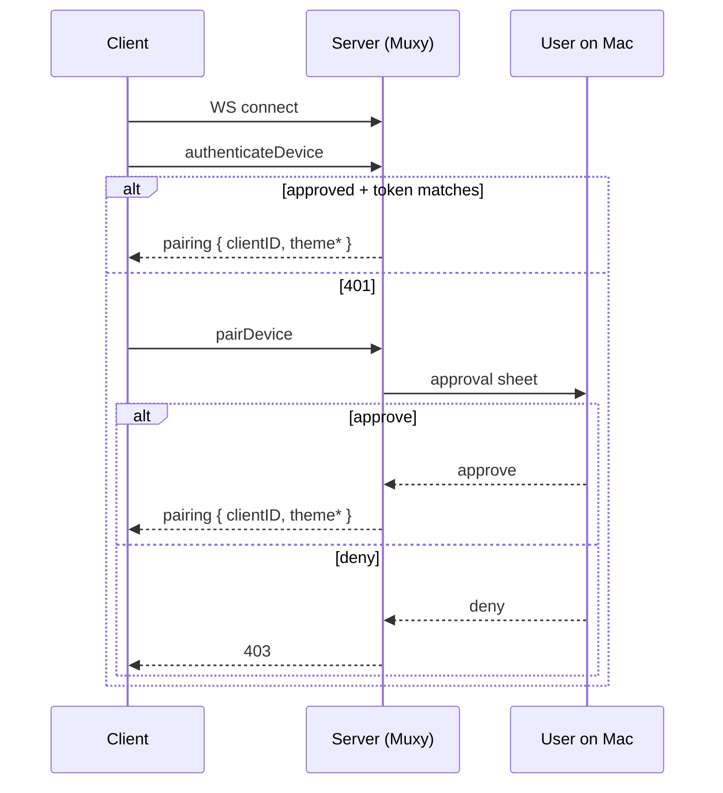

# Pairing & Authentication

Each client should generate and persist:

- `deviceID` — a stable UUID for that install
- `deviceName` — a user-friendly label
- `token` — a random secret persisted securely on the client

## Connection flow



Until authentication succeeds, every other API call returns `401 Authentication required`.

## `authenticateDevice`

Authenticates a previously approved device.

```json
{
  "type": "authenticateDevice",
  "value": {
    "deviceID": "2f8d1f9f-e065-4f62-af30-8c4b3d0bfc53",
    "deviceName": "Pixel 9",
    "token": "random-secret-token"
  }
}
```

Success result:

```json
{
  "type": "pairing",
  "value": {
    "clientID": "62ea9d06-a1f4-4a11-9f39-33ee322f6573",
    "deviceName": "Pixel 9",
    "themeFg": 16777215,
    "themeBg": 197379,
    "themePalette": [0, 16711680, 65280]
  }
}
```

`themeFg`, `themeBg`, and `themePalette` are optional and may be omitted.

## `pairDevice`

Same request shape as `authenticateDevice`. Triggers the approval sheet on the Mac. Same `pairing` result on success.

## `registerDevice`

Registers a transient session for a device that has not persisted credentials. Returns a `deviceInfo` result with the same fields as `pairing`.

```json
{
  "type": "registerDevice",
  "value": {
    "deviceName": "Pixel 9"
  }
}
```

## Token mismatch

A token mismatch is treated the same as unknown — the server returns `401` so a stolen but outdated credential can't resume authentication. Re-pair from the client to recover.

## Revocation

The Mac's **Settings → Mobile** lists approved devices. Revoking removes the device from `approved-devices.json` and terminates any active connection for that `deviceID`.
