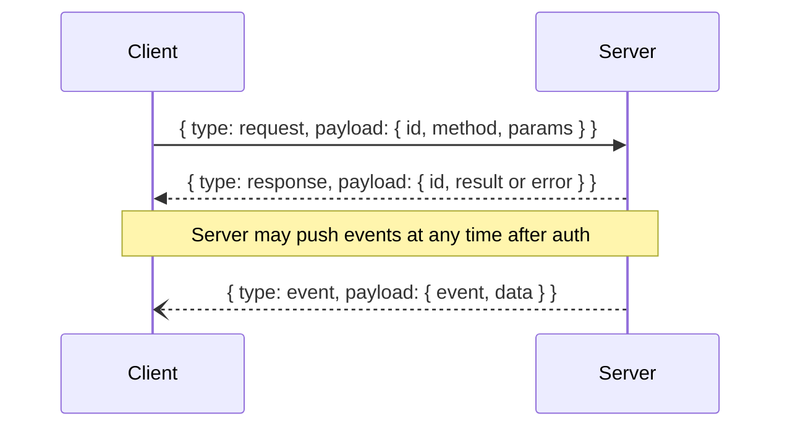

# Protocol

Every WebSocket frame is a JSON object with a top-level `type` field. Three types: `request`, `response`, `event`.



## Request envelope

```json
{
  "type": "request",
  "payload": {
    "id": "request-id",
    "method": "listProjects",
    "params": null
  }
}
```

Rules:

- `id` is unique per in-flight request.
- `method` identifies the API operation.
- `params.type` must match `method` when params are present.
- Methods without parameters may send `params: null`.

Example with params:

```json
{
  "id": "req-1",
  "method": "getWorkspace",
  "params": {
    "type": "getWorkspace",
    "value": {
      "projectID": "9b84c9a0-1d55-4c64-bbf6-ef59ee02fa09"
    }
  }
}
```

## Response envelope

Success:

```json
{
  "type": "response",
  "payload": {
    "id": "request-id",
    "result": { "type": "ok" }
  }
}
```

Failure:

```json
{
  "type": "response",
  "payload": {
    "id": "request-id",
    "error": { "code": 401, "message": "Authentication required" }
  }
}
```

Only one of `result` or `error` is present; the unused field is omitted.

## Event envelope

```json
{
  "type": "event",
  "payload": {
    "event": "workspaceChanged",
    "data": {
      "type": "workspace",
      "value": { "projectID": "…", "worktreeID": "…", "focusedAreaID": "…", "root": { "type": "tabArea", "tabArea": { … } } }
    }
  }
}
```

See [Events](events.md) for the full list of pushed events and their data types.
