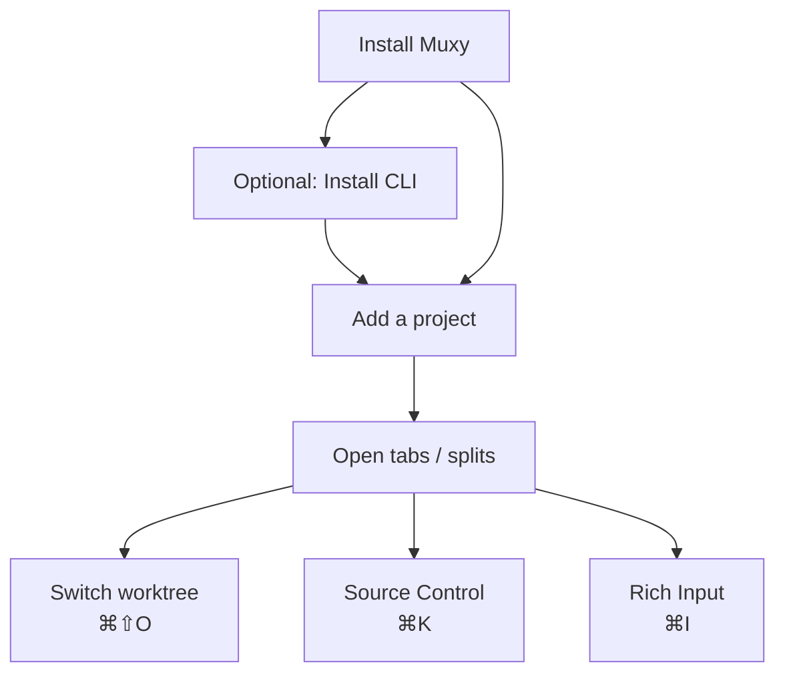

# Getting Started

A 2-minute tour from install to a working session.

## Requirements

- macOS 14 or newer (Apple Silicon or Intel)

## Install

1. Download the latest build from the releases page.
2. Drag `Muxy.app` to `/Applications` and launch it.
3. Optional: **Muxy → Install CLI** writes a `muxy` wrapper to `/usr/local/bin/muxy`.

## Add your first project

A project is just a directory you've added to Muxy.

1. Open the sidebar with `⌘B` (or **View → Toggle Sidebar**).
2. Click **+** at the bottom of the sidebar — or **File → Open Project…** (`⌘O`).
3. Right-click the project to rename, recolor, or change its icon.

Projects persist in `~/Library/Application Support/Muxy/projects.json`.

## Tabs & splits cheat sheet

| Action | Shortcut |
| --- | --- |
| New tab | `⌘T` |
| Rich input | `⌘I` |
| Split right / down | `⌘D` / `⌘⇧D` |
| Focus pane | `⌘⌥←/→/↑/↓` |
| Maximize pane | `⌘⌥↩` |
| Close pane / tab | `⌘⇧W` / `⌘W` |
| Switch tabs | `⌘1…9`, `⌘]` / `⌘[` |

Tabs can also hold a Source Control view, an editor, or a diff. See [Tabs & Splits](../features/tabs-and-splits.md).

## Switching projects & worktrees

- **Project navigation**: `⌃]` / `⌃[`, or `⌃1…9`.
- **Switch worktree**: `⌘⇧O`. Each worktree has its own tabs/splits.

## Source Control

`⌘K` opens the source-control view: staged/unstaged/untracked, commit box, branches, PRs. See [Source Control](../features/source-control.md).

## Configuring Ghostty

Muxy renders terminals through libghostty. Edit `~/.config/ghostty/config` from **Muxy → Open Configuration…** and reload with `⌘⇧R`.

## Next steps

- [Keyboard Shortcuts](keyboard-shortcuts.md)
- [Layouts](../layouts/overview.md) — reproducible per-project workspaces
- [Settings](settings.md) — every preference explained
